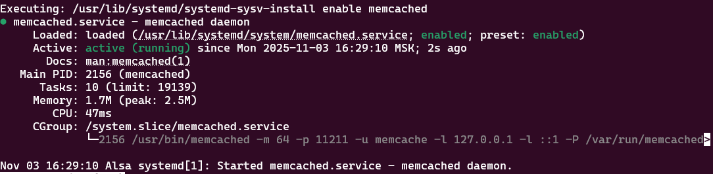
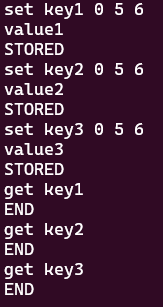
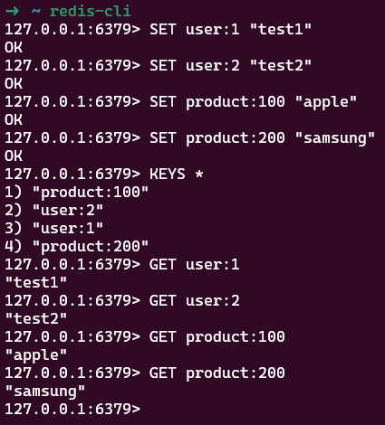

# Домашнее задание к занятию "`Кеширование Redis/memcached`" - `Белолипецкий Леонид`

---

### Задание 1

1. Проблема высокой нагрузки на базу данных  
2. Проблема медленного отклика приложения  
3. Проблема масштабируемости  
4. Проблема повторяющихся тяжелых вычислений  
5. Проблема сессионных данных  

---

### Задание 2

---

### Задание 3

---

### Задание 4

---
